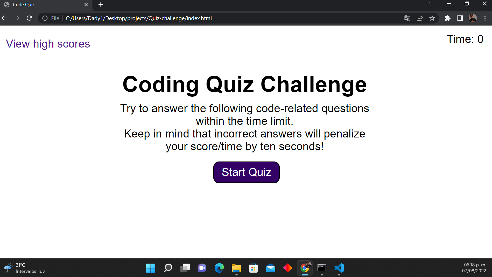
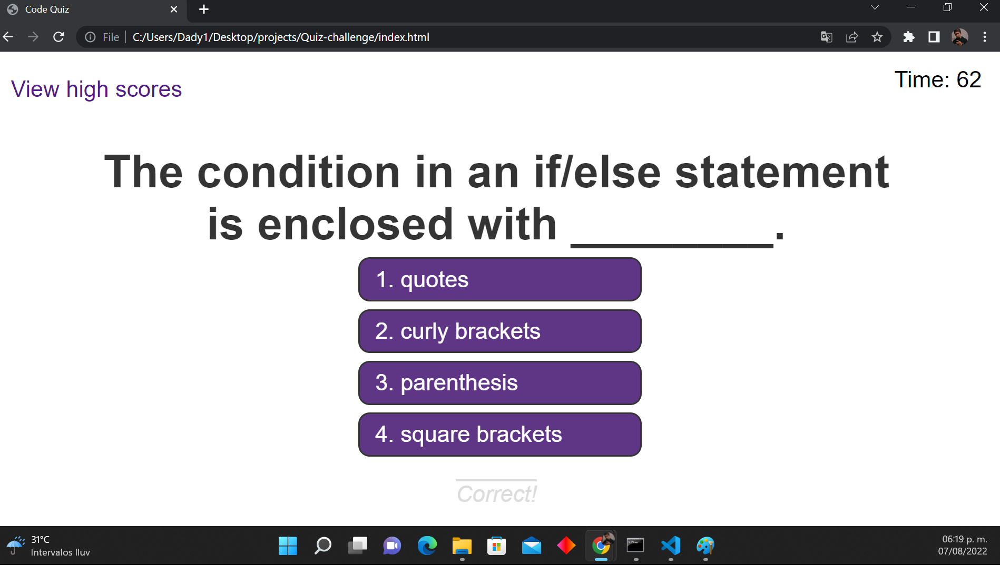
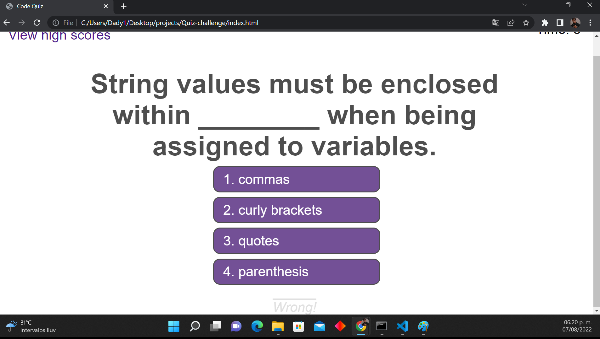
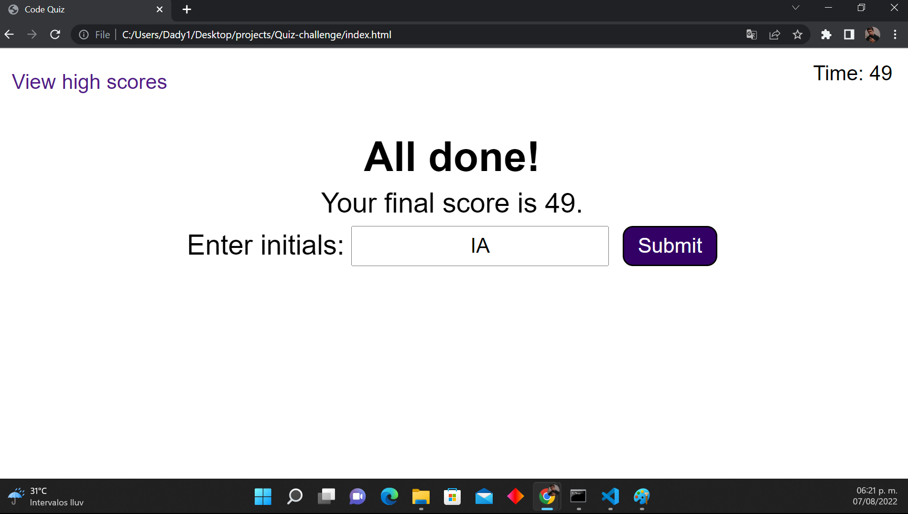
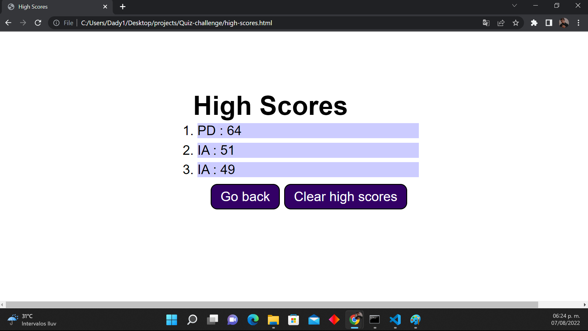

# Coding Quiz

[](https://github.com/israel2800)
[](https://github.com/israel2800/quiz-challenge)
[](https://github.com/israel2800/quiz-challenge)

## Table of Content
* [ Project Links ](#Project-Links)
* [ Screenshots-Demo ](#Screenshots)
* [ Project Objective ](#Project-Objective)
* [ User Story ](#User-Story)
* [ Technologies ](#Technologies)
* [ Installation ](#Installation)
* [ Usage ](#Usage)
* [ Credits and Reference ](#Credits-and-Reference)
* [ Author Contact ](#Author-Contact)
* [ License ](#License)

##  Project Links
Website link:
https://israel2800.github.io/cool-quiz/

GitHub project:
https://github.com/Israel2800/quiz-challenge


## Screenshots-Demo
**Start Quiz:**



**Correct Answer:**



**Incorrect Answer:**



**End of the Quiz:**



**High Scores:**



## Project Objective
A quiz with different types of coding questions, it let you know the difference between similar concepts we normally use. You will have a total of 75 seconds to choose an option for each question but keep in mind that incorrect answers will penalize your time by ten seconds!

## User Story
AS A coding boot camp student, I WANT to take a timed quiz on JavaScript fundamentals that stores high scores, SO THAT I can gauge my progress compared to my peers.

## Technologies 
```
* HTML
* CSS
* JavaScript
```

## Installation
Access to the GitHub project and clone or download the project, you can do this by clicking in the green button with the word "Code". If you decided to clone the repo you need to choose one of the SSH/HTTPS keys and copy one, after this you will need to open the terminal of your choice and type "git clone 'key'" you will need to paste one of the two keys you previously select and then click enter. If you decided to download the project you will click the "Download.zip" option and the project will be downloaded so you will locate the file and do a right-click to select "Extract All" and finally you can choose where to place it.

## Usage 
To use this app you will need to download and install the Terminal for Mac or Gitbash for Windows. Once you have the project downloaded you will open it with your favorite code editor. You will see all the files and folders, click the "index.html" file, then type "alt + b" and you will be able to display the webpage with all the CSS styles. You can also click [here](https://israel2800.github.io/quiz-challenge/) to open the website.

## Credits and Reference
The following link helped me with the project: [CSS](https://developer.mozilla.org/es/docs/Web/CSS)

## Author Contact
Contact the author with any questions!<br>
Github link: [Israel2800](https://github.com/israel2800)<br>
Email: dady281100@gmail.com

## License
This project is [MIT](https://choosealicense.com/licenses/mit/) licensed.<br />

Copyright © 2022 [ISRAEL AGUILAR](https://github.com/israel2800)

<hr>
<p align='center'><i>
This README was generated with ❤️ by ISRAEL AGUILAR
</i></p>
